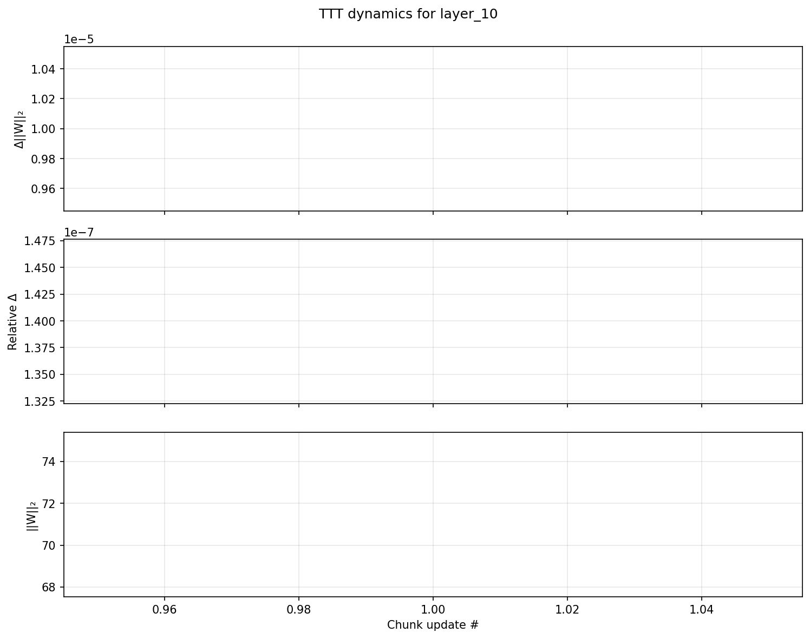
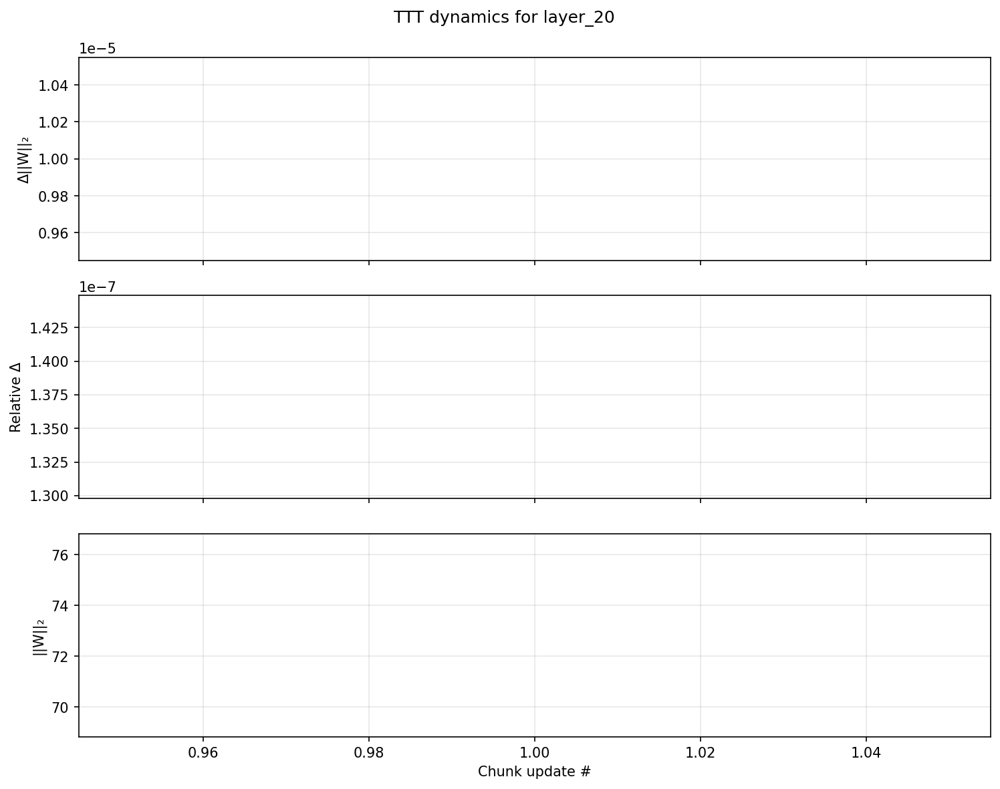
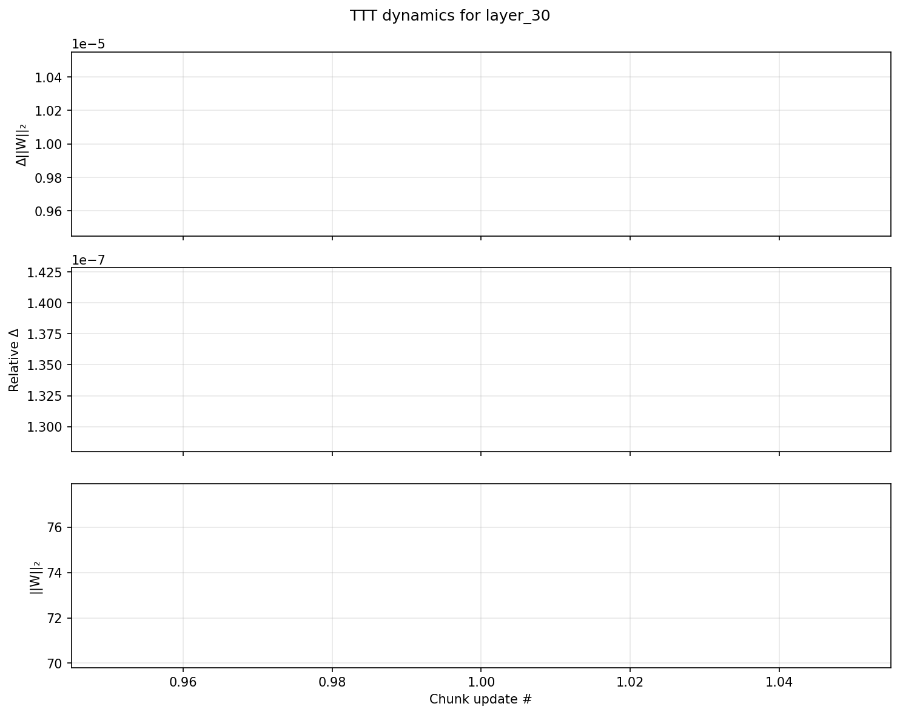

# TTT Inference Report: combined_1595476768245534437_24000hz_1763126017

## Run metadata
- **batch_size**: 1
- **cfg_coef**: 1.0
- **chunk_size**: 256
- **dtype**: torch.bfloat16
- **input_file**: /sise/eliyanac-group/ron_al/examples/combined_1595476768245534437_24000hz.wav
- **lora_weights**: /sise/eliyanac-group/ron_al/ttt_training_run2/checkpoints/checkpoint_001000/consolidated/lora.safetensors
- **ttt_layers**: 3
- **ttt_learning_rate**: 0.0001

## Layer summaries
### layer_10
- Updates: 1
- Total Tokens: 2.0
- Max Relative Delta: 1.3993291032374526e-07
- Clip Events: 1
- Final Post Norm: 71.46282196044922

### layer_20
- Updates: 1
- Total Tokens: 2.0
- Max Relative Delta: 1.373276847104564e-07
- Clip Events: 1
- Final Post Norm: 72.81852722167969

### layer_30
- Updates: 1
- Total Tokens: 2.0
- Max Relative Delta: 1.3539776574760494e-07
- Clip Events: 1
- Final Post Norm: 73.85646057128906

## Plots

## Artifacts
- Raw events: `combined_1595476768245534437_24000hz_1763126017_ttt_monitor.json`